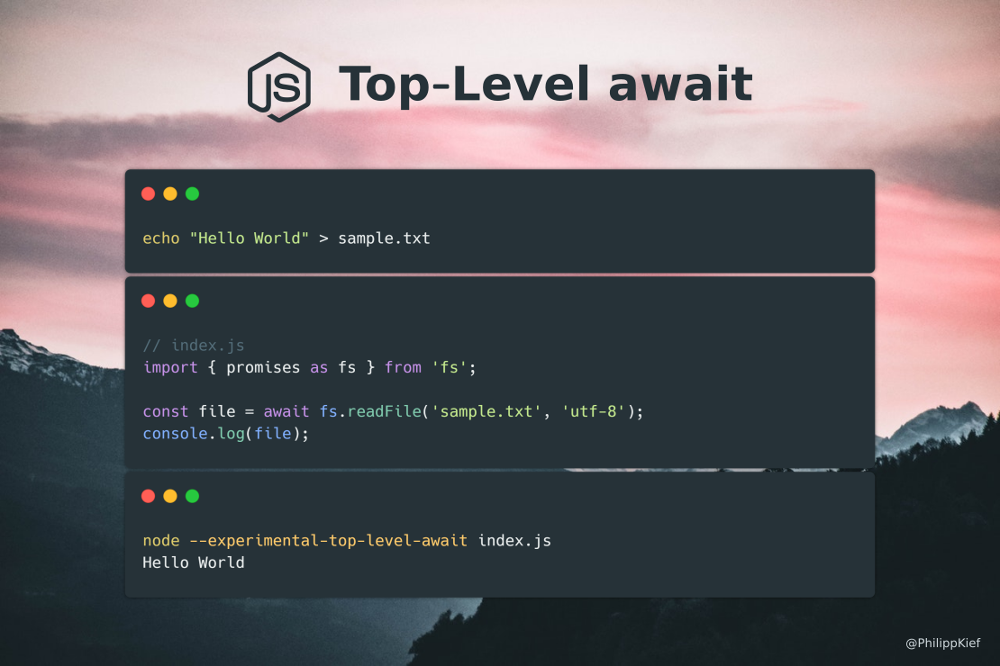

# Node.js Top-Level `await`



## Getting started

- Install [Node.js 14.3.0](https://nodejs.org/dist/v14.3.0/)

## Run sample code

```
npm start
```

## References
- [Support since Node.js 14.3.0](https://github.com/nodejs/node/blob/master/doc/changelogs/CHANGELOG_V14.md#support-for-top-level-await)
- [Official documentation](https://nodejs.org/api/esm.html#esm_experimental_top_level_await)